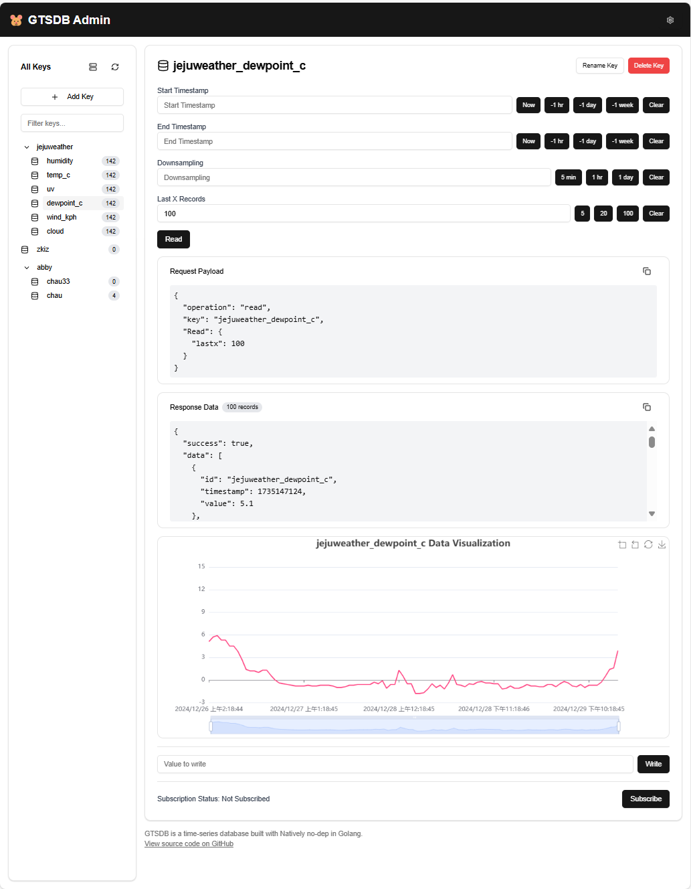

# GTSDB Admin

A modern web-based administration interface for GTSDB (Go Time Series Database).



## Features

- Real-time data visualization with ECharts
- Key management (create, rename, delete)
- Data operations (read, write)
- Time series data querying with downsampling
- Dark/light theme support
- Responsive layout

## Getting Started

First, install the dependencies:

```bash
npm install
```

Then run the development server:

```bash
npm run dev
```

Open [http://localhost:3000](http://localhost:3000) in your browser to access the admin interface.

## Configuration

Configure your GTSDB connection settings in the UI settings panel:
- Hostname
- Port

## Tech Stack

- Next.js 14
- TypeScript
- Tailwind CSS
- shadcn/ui components
- ECharts for data visualization
- React Context for state management

## License

MIT License

